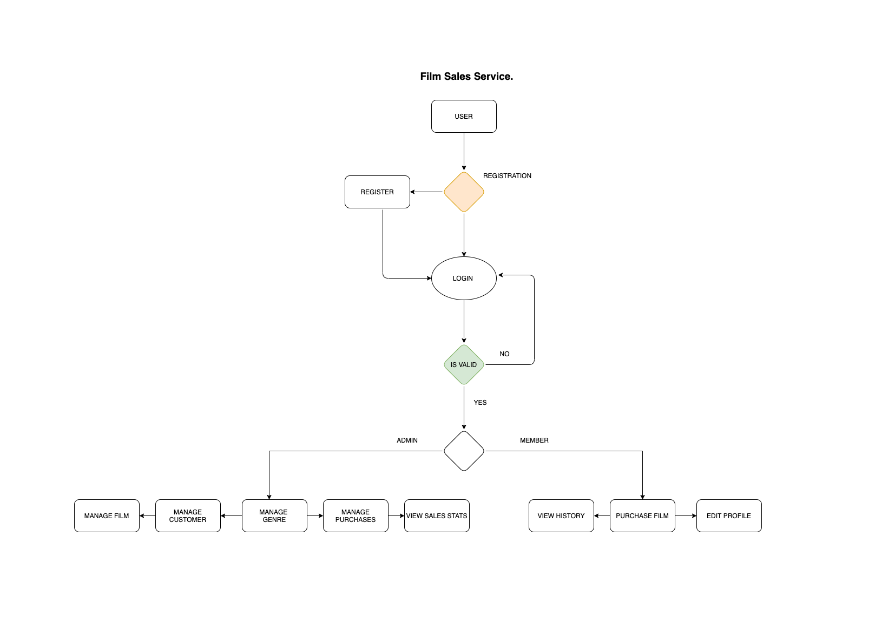
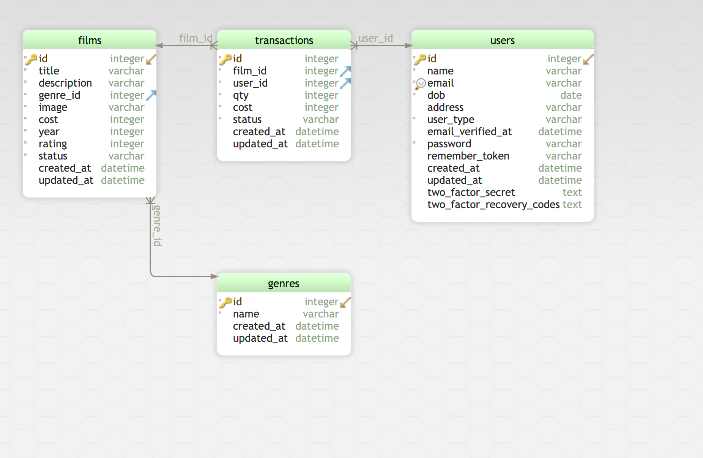
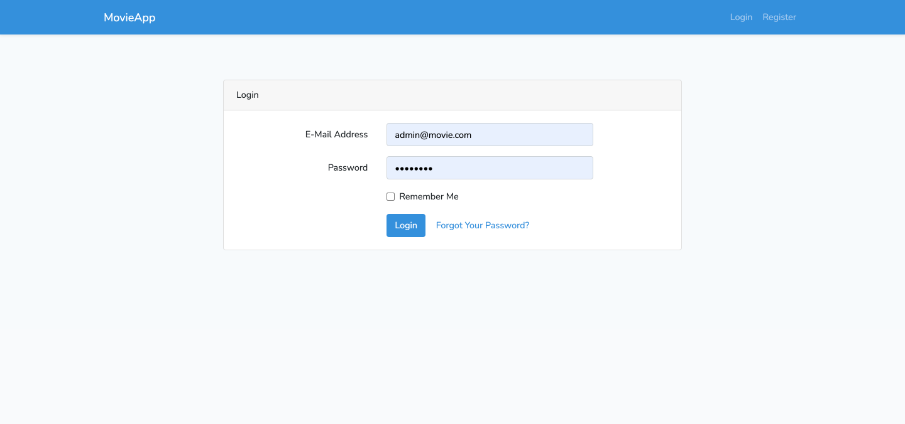
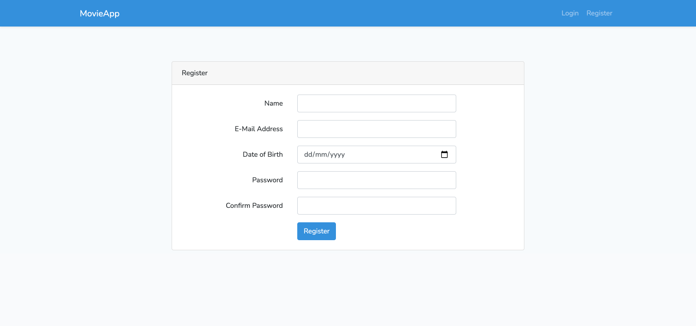
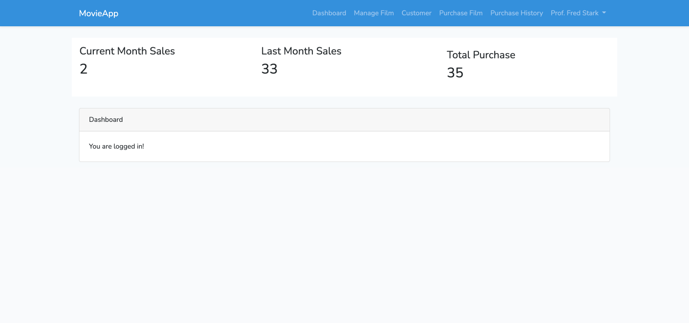
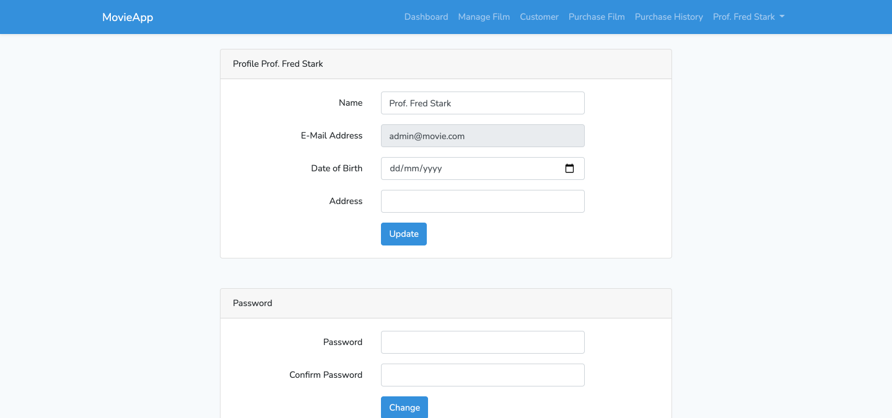
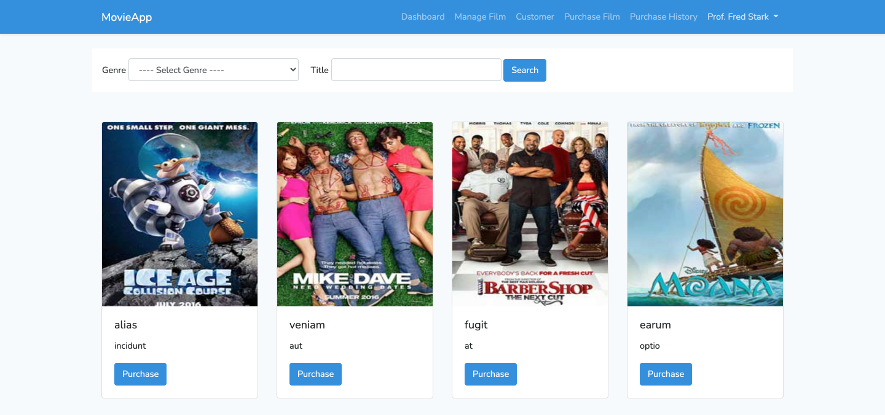
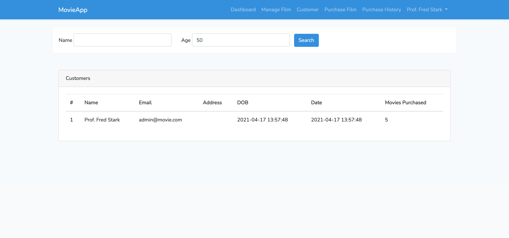
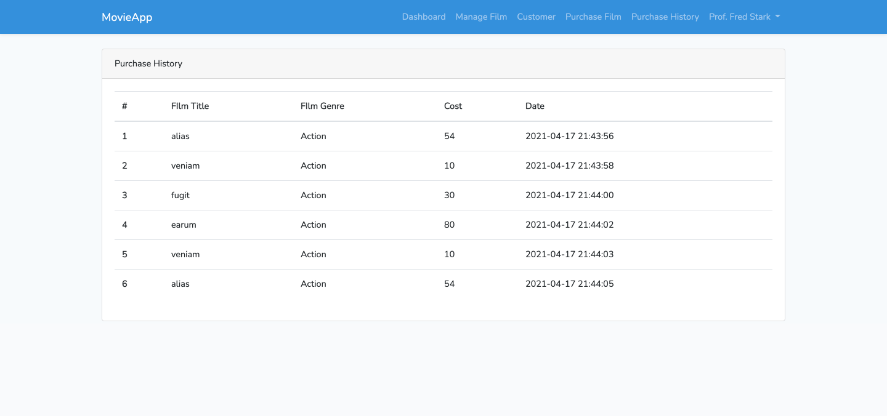

## Film Sales Service 

This case study provides information regarding the Film Sales Service. The system will allow
customers to browse the films that are available for purchase online, with a view to
purchasing one or more of the films. Also, the system has different Genres associated with
the specific film. Before a purchase is made the customer must login so they can make a
payment using their existing credit card details. For new customers, they must register with
the sales service before they can make a purchase etc.

## Tasks Deliverables 

their existing credit card details. For new customers, they must register with
the sales service before they can make a purchase etc.
As such, the required functionality are as follows:
- A new customer should be registered (name, email address, date of birth, and so on).
- A customer can purchase a film.
- Customers can edit their personal and account details (i.e. change address, password)
- Customers can view all their past purchases.
- Admin should be able to create, edit, view and delete films
- Admin should be able to view a report of:
- Customers whose age is above 50
- Films that have Genre – ‘Action’
- The total number of monthly sales.
- The products that end with the character ‘s’
- The total number of films purchased by the customers

## Flowchart 

## Entity Relationship Diagram (ERD) of your Database

## Screenshots of the website

